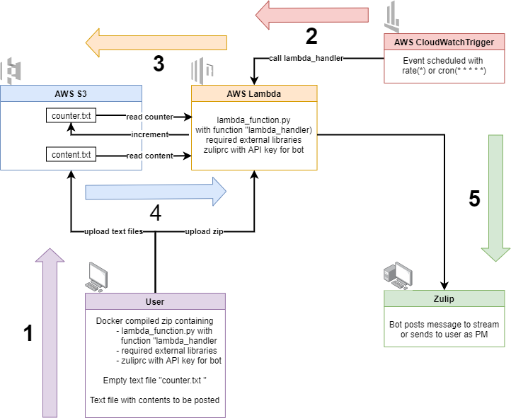

# AWS_Zulip_bot
This repository shows how to write a bot for Zulip that runs on AWS and sends scheduled messages to streams or to users.

This can be used for example to post a daily quote into your organization's Zulip or check-in message at the beginning or the end of the day asking your team members about the work they planned or finished.

Below is a schematic outlining the process flow.

In order create your own bot, first create a new AWS S3 bucket where you upload a *.txt* with the content to be posted as well as *counter.txt* with its value set to 0.

Download the *.zip* in this repository and edit *lambda_function.py*. Then replace the *zuliprc* file with the one for your bot, downloaded from Zulip.

Create a new AWS Lambda function running Python 3.6 and upload the *.zip*. It already contains the required Python Zulip library and was compiled on amazonlinux in Docker. 

Lastly, add a AWS CloudWatchTrigger specifying the posting frequency for the bot.

